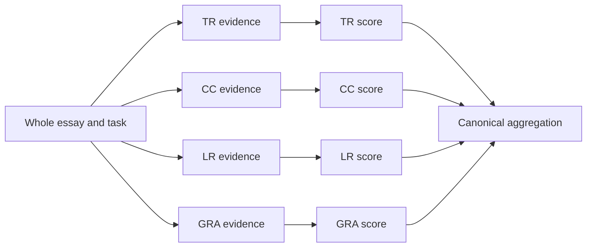
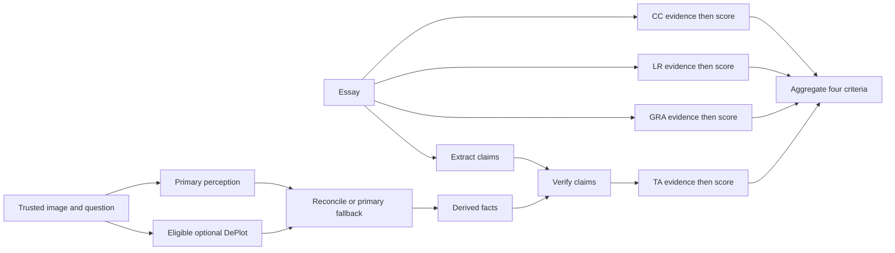

# IELTS Writing latency: dependency graphs, bounded concurrency and serving

Implementation session: 2026-10-08. Starting commit:
`814197afcf83b9ed8bcc71fc01d914808c668f7b` on local `main`, also the remote-main
reference supplied for this task. The worktree already contained uncommitted
scoring-neutrality changes: 18 modified files and three new files. That local
scorer was the baseline for this phase; remote prompt text was never restored.
No commit, push, deployment or real GPU inference was performed in this phase.

## 1. Executive Summary

The application awaited every criterion before starting the next. Task 1 also
delayed text-only assessment behind visual perception, optional DePlot, facts
and claims. This put independent requests on a single serial critical path.
The deployed vLLM command explicitly allowed one sequence, so merely launching
more backend tasks would leave another serving bottleneck.

Task 2 now runs four independent evidence-then-score pipelines concurrently.
Task 1 runs CC/LR/GRA and claim extraction alongside perception, with optional
DePlot extraction in a separate branch. TA still waits for its actual visual
and claim dependencies. Each run limits outstanding LLM completions, defaults
to two, and retains criterion-local state. The Modal deployment definition now
permits two inputs and vLLM sequences by default, configurable to 1/2/4.

The same model, criterion prompts, source validation, score aggregation,
half-bands and Vietnamese feedback remain. Local Task 1 scoring v5 / Task 2 v7
and Task 1 visual v3 were preserved. No merged judge, prompt shortening, numeric
calibration, weaker perception, new model, larger GPU or replicas were added.

The synthetic harness measured total latency reductions of 44.4% for Task 2,
34.1% for Task 1 without DePlot, and 40.0% with DePlot, at concurrency two.
Those are local fake-I/O measurements, not deployed GPU performance or human
scoring agreement. Task 2 time to first result regressed in that configuration;
the report makes that trade-off visible.

## 2. Architecture Before Optimization


Without retries, Task 2 required eight LLM completions. Task 1 required those
eight plus perception, claim extraction and sometimes semantic verification.
DePlot is an additional optional service call. Every awaited stage extended
elapsed time even when it did not depend on the preceding result.

## 3. Profiling / Baseline

The reproducible baseline is an evaluation-only sequential reference using
the **current local prompts and validation**, not old calibration prompts.
`app/evaluation/writing_latency.py` changes only execution ordering between
reference and production services. Its fixed synthetic fixture is original
fictional content in `benchmarks/writing_latency/synthetic.json`. The one-pixel
PNG exercises trusted-image payload handling; it is not a perception benchmark.

The recorded experiment ran on Windows, Python 3.13.9, three repeats per
configuration, with 100 ms fake provider readiness, 100 ms per completion,
and 100 ms per enabled specialist extraction. OS scheduling adds overhead.
The trace callback is a no-op, so these totals exclude PostgreSQL, SSE polling,
HTTP networking and GPU inference. Each run checks equality of full results
and of requests grouped by stage/criterion, including messages, schemas and
`CompletionOptions`. Calls and scripted token usage are checked too.

Run from `backend/`:

```powershell
uv run --no-sync python ../scripts/benchmark_writing_latency.py --repeats 3 --delay-ms 100 --output ../benchmarks/writing_latency/reports/session.json
```

The JSON stores every total/first-result sample, medians, readiness, per-stage
medians, concurrency peaks, call counts, token totals and prompt versions.
Reports are ignored; the fixture and harness are committed-source candidates.
The numbers in section 11 are from the final instrumented harness run in this
session, rather than a combination of best runs.

`WritingLatencyMetrics` uses `time.perf_counter()` for elapsed durations.
The worker creates it before input preparation and measures provider readiness
once. `run_total_ms` ends after assessment, before the terminal transaction;
it includes input preparation and intermediate checkpoint waits, but excludes
the initial create-run HTTP request, browser delivery and final commit latency.
`time_to_first_criterion_ms` ends when the first valid criterion result is ready,
just before its persistence callback. It is not a browser paint measurement.

Instrumentation covers readiness; criterion evidence/scoring; visual grounding;
DePlot; reconciliation; facts; claim extraction; and verification. Attempts
record duration, attempt number, allowlisted finish reason and numeric token
counts. Evidence/scoring stage durations include checkpoint time; completion
attempt durations include semaphore wait and provider time. They are not pure
GPU kernel time. Fixed keys and at most two attempt records per stage keep the
summary bounded. No essay, prompt, output, image or credential enters timings.
The existing usage JSON stores snapshots under `latency`; no migration or
public DTO extension is needed.

Real cold-start and warm inference performance: **Not measured in this implementation session**.
To measure later, deploy the tested definition once, record container lifecycle
from Modal, and run an original/licensed Task 2 plus an optional synthetic Task
1. A cold run must be identified by an actual new container, not inferred from
readiness duration. A warm run should reuse that container. Record run ID,
configuration, readiness, total, first result, stage durations, repairs and
usage JSON. One run is a smoke observation; p50/p95 require a planned sample
set. Readiness can also include proxy/network/queue wait, not only cold start.

## 4. Root Causes

| Cause | Implication | Implemented response |
| --- | --- | --- |
| Serial traits | Latency approached the sum of eight request waits | Independent criterion tasks |
| Task 1 false dependencies | Language feedback waited for an image it never used | Linguistic/claim branches start early |
| `--max-num-seqs 1` | No multi-sequence scheduling in an iteration | Configurable 1/2/4, default 2 |
| Modal admission | A web-server container also needs concurrent input admission | `modal.concurrent` tied to sequence setting |
| Scale to zero | A request may pay model/process startup | Explicit cost/interactive idle profiles |
| Separate optional DePlot | Additional cold start/extraction could lengthen TA path | Image-only extraction overlaps primary |
| Generation and tokens | Same evidence and feedback must still be generated | Preserve work; overlap independent waits |
| DB/SSE | Checkpoints, locks and delivery add overhead | Keep short durable checkpoints; measure honestly |

Real generation, DB and SSE percentages are **Not measured in this implementation session**.
Use stage/attempt differences and database timing telemetry for a representative
run, and browser/API timestamps for delivery. Do not infer that overhead is
negligible from the no-op-trace synthetic benchmark.

## 5. Architecture After Optimization





Without DePlot, primary perception goes directly to facts. Claim verification
waits for extraction plus the finalized reference and facts. TA proceeds with
the existing warning/unknown-evidence policy if auxiliary work fails; unusable
primary perception still prevents TA success. Aggregation waits for all four
successful criterion results. A partial run has no invented mean or overall.

**Sum of work versus wall-clock critical path:** in the old Task 2 graph,
`T ≈ ready + Σ(evidence_i + score_i)`. With enough serving capacity, the
concurrent ideal approaches `ready + max(evidence_i + score_i)`. At limit two,
queueing means it will lie between those bounds; it is not automatically half
the time. Task 1's ideal is the maximum of its language branches and TA branch,
where TA includes the slower eligible perception path, facts, the extraction
join, verification and its two scoring turns. Real GPU resource contention,
batching efficiency and checkpoint overhead change those estimates.

Concurrent stage durations overlap, and attempt durations include queue wait.
Adding them is not a GPU-compute measurement. The same token totals and request
counts can produce a shorter critical path without eliminating total work.

## 6. Concurrency Model

Each run constructs a service and an `asyncio.Semaphore` through
`BoundedWritingProvider`. `AI_WRITING_MAX_CONCURRENT_LLM_REQUESTS` defaults to
2 and accepts integers 1–4. Candidate tests and benchmarks cover 1, 2 and 4.
The semaphore guards **every** Ministral/provider completion, including
perception, extraction, semantic verification, evidence, scoring and repairs.
DePlot uses its separate optional service and is scheduled at most once per
eligible run, with the existing timeout. There is no global semaphore shared
between users. Two users can each have two requests; serving admission and
vLLM queue them against the single GPU. This is not unlimited GPU capacity or
application-wide fairness enforcement.

Task 2 starts four tasks. Each retains evidence → source validation → scoring
→ score validation in that order. There is no information dependency between
traits, and their prompts never include another trait's output. A half-band
continues to come from the scorer, with the same allowed range and aggregation.

`CriterionExecutionState` owns stage, usage, diagnostics, result and failure.
There is no shared `current_criterion`/`current_stage` cursor. The same trait
identifier labels its calls, repairs and events regardless of completion order.
Auxiliary Task 1 diagnostics remain attributed to TA and their named stage.
Returned usage/diagnostic snapshots are newly assembled lists.

Provider/validation and unexpected Python errors inside a criterion become a
safe local failure, so siblings still finish. The task gather waits for ordinary
errors before propagating unhandled ones. Persistence/lease-stop errors use
`TraceFailure` and cancel the run's children promptly. External cancellation
also cancels and awaits every child, including nested Task 1 branches and
semaphore waiters. No background inference coroutine is left detached.

## 7. vLLM Continuous Batching

Backend concurrency makes independent HTTP requests available at the same
time; it does not manufacture GPU compute. vLLM schedules active sequences
together across generation iterations, admitting work as capacity becomes
available. With a one-sequence limit, concurrent HTTP requests still queue.
The relevant meaning is documented in the pinned [vLLM 0.13 serve reference](https://docs.vllm.ai/en/v0.13.0/cli/serve/#max-num-seqs).

`deploy/modal/writing_llm_config.py` supplies a validated deployment setting:
`IELTS_WRITING_LLM_MAX_NUM_SEQS`, choices 1/2/4, default 2. The deployment also
sets `@modal.concurrent(max_inputs=config.max_num_seqs)` so more than one
request can reach the web-server process. Modal requires explicit input
concurrency; see its [input concurrency guide](https://modal.com/docs/guide/concurrent-inputs).
Host settings are frozen into image environment values so remote imports use
the same definition. This defines serving capacity; no new deployment ran here.

The model remains Ministral 3 8B Instruct 2512 on one L4, vLLM 0.13.0,
8192 context, 0.90 GPU memory utilization, eager execution, one image per
prompt, four CPUs and 32768 MiB host memory. `max_containers=1` and protected
proxy authentication remain. More active sequences need KV-cache capacity and
share resources, so a larger limit can increase per-request latency or memory
pressure. Two is a conservative candidate, not a measured L4 optimum.

GPU batching efficiency, token throughput, queue delay and peak VRAM are
**Not measured in this implementation session**. Validate 1/2/4 against the
same representative licensed/synthetic inputs, fixed model/runtime/context,
known warm state and controlled concurrent users. Record success/OOM rate,
repair rate, tokens/s, GPU memory, queueing, total and first-result latency.
Use vLLM metrics/Modal lifecycle telemetry alongside backend timings. This
session exercised configuration wiring with a fake SDK and allocated no GPU.

## 8. Task 1 Pipelining

CC evaluates organisation and cohesion, LR evaluates vocabulary, and GRA
evaluates grammatical range/accuracy. Their existing payloads contain text
and the task, with no image, visual reference, facts or claim verification.
Starting them early changes scheduling, not their assessment context.

Claim extraction reads only essay sources and task type. It can run before
visual grounding, but verification cannot: verifying a claim needs the claims,
grounded reference and derived facts. Facts can finish while extraction waits.
Primary perception uses the trusted image and question, without essay quality
judgments. DePlot needs the image independently, so the extraction branch starts
concurrently only for enabled `CHART_TABLE` tasks. PROCESS/MAP/SYSTEM/OTHER
never schedule it.

Reconciliation still runs on a deep copy of the primary reference. DePlot
failure or a reconciliation exception retains that primary reference with the
same safe fallback codes. If primary perception is unusable, DePlot is never
promoted into a replacement. It may already have been requested because the
two extractions now overlap; the result is then discarded for scoring.
Existing Decimal parsing, confidence rules, derived facts and deterministic
claim verification were not redesigned.

Only TA joins these dependencies before retrieval and scoring. Language
results can already be checkpointed and displayed while perception is pending.
The barrier tests demonstrate this even when all visual/claim branches are
blocked; no tight wall-time assertion is needed.

## 9. Cold Start vs Cost

`min_containers=0` retains scale to zero. `scaledown_window` controls the idle
grace period before downscaling, not an absolute guarantee of a warm model.
Longer idle windows can avoid repeated startup during a study session and
consume more billed idle GPU time. Modal explains these controls in its
[cold-start guide](https://modal.com/docs/guide/cold-start).

| Profile | Deploy-time setting | Idle grace | Minimum containers |
| --- | --- | --- | --- |
| Cost, default | `IELTS_WRITING_LLM_PROFILE=cost` | 60 seconds | 0 |
| Interactive | `IELTS_WRITING_LLM_PROFILE=interactive` | 300 seconds | 0 |
| Explicit override | `IELTS_WRITING_LLM_SCALEDOWN_SECONDS` | 60–900 seconds | 0 |
| Always warm, future only | Would require `min_containers=1` | Ongoing idle cost | Not implemented |

These settings affect Ministral only; DePlot retains its existing separate T4
service and idle policy. There is no hidden prewarm loop, fake readiness job,
new replica or always-on allocation. Changing a deploy-time setting requires
an explicit deployment. Backend concurrency settings belong in backend/Modal
configuration, not in a frontend client.

Example interactive deployment, from the repository root, when intentionally
ready to deploy using an installed/configured Modal CLI:

```powershell
$env:IELTS_WRITING_LLM_PROFILE = 'interactive'
$env:IELTS_WRITING_LLM_MAX_NUM_SEQS = '2'
modal deploy deploy/modal/app.py
```

Keep `AI_WRITING_MAX_CONCURRENT_LLM_REQUESTS=2` in backend configuration for
the default candidate. For an isolated one-request mode, set backend limit and
server sequences/admission to 1. This remains the new concurrent DAG with
serialized provider access; it does not reconstruct the old trait ordering.

Actual cold-start latency, warm-hit rate and billed cost difference are
**Not measured in this implementation session**. Compare lifecycle and billing
records for representative study-session spacing under 60 versus 300 seconds,
including the separate DePlot service. Choose based on user traffic and budget.

## 10. Reliability Constraints

- Every SSE event still goes through a short PostgreSQL transaction, row lock
  and persisted monotonic sequence. Concurrent callbacks use a per-run lock;
  provider work never holds it. Cancellation shields an in-progress checkpoint,
  awaits that transaction, and then propagates cancellation. This protects
  completed progress without orphaning the checkpoint.
- Criteria can complete out of order. Final DTOs and partial `progress`/failure
  maps use TA/TR, CC, LR, GRA order. PostgreSQL JSONB object order is not an API
  guarantee, so `present_run` explicitly reconstructs canonical order.
- The frontend already maps fixed criterion positions and counts actual
  results; no frontend behavior/types changed. Its single activity field shows
  the most recent persisted stage, not every concurrently running task. SSE
  reconnects replay stored events and never rerun inference.
- A local trait failure retains sibling results and diagnostics. A partial
  failure never calculates an overall score. Shutdown marks unfinished
  criteria interrupted without changing completed ones. Detached worker
  lifetime remains independent of a disconnected SSE client; lease checks and
  heartbeats continue.
- Evidence/scoring retain one bounded repair: normal evidence 1800 tokens,
  normal scoring 3072, and scoring length repair 4096. Adapter context handling
  and finish-reason validation remain intact. Perception retains its existing
  default options and repair behavior.
- Safe fallback codes, protected provider endpoints, trusted asset bytes,
  source-ID validation, exact quotes and Vietnamese feedback remain. Metrics
  use numeric metadata and fixed identifiers; exception bodies are not logged.
- AI output remains advisory. The worker writes AI-run/event records, not
  official or human grading tables. Historical attempts and frozen task inputs
  keep their existing ownership and immutability checks.

Tests cover barrier overlap, per-run limits across two simulated users,
criterion-local unexpected errors, concurrent repairs, cancellation draining,
durable checkpoints, out-of-order partial restoration, SSE sequence/replay,
visual failures, DePlot fallback and official-score isolation. Existing provider
budget/context and scoring-profile tests remain in the focused regression set.

Reproduce the focused backend regression from `backend/` with a reachable
rollback-isolated PostgreSQL test database configured as in `tests/conftest.py`:

```powershell
$latencyTests = @(
  'tests/test_mts_descriptor_fit.py', 'tests/test_mts_writing_v3.py',
  'tests/test_mts_writing_v4.py', 'tests/test_mts_writing_v5.py',
  'tests/test_mts_writing_validation.py', 'tests/test_task1_visual.py',
  'tests/test_task1_visual_numbers.py', 'tests/test_task1_grounding_contract.py',
  'tests/test_task1_grounding_regression.py', 'tests/test_task1_calibration.py',
  'tests/test_task1_benchmark.py', 'tests/test_task1_benchmark_metrics.py',
  'tests/test_chart_cross_check.py', 'tests/test_deplot_deployment.py',
  'tests/test_writing_completion_budgets.py', 'tests/test_writing_llm_providers.py',
  'tests/test_writing_llm_readiness.py', 'tests/test_vllm_context_budget.py',
  'tests/test_writing_ai_output_normalization.py', 'tests/test_modal_app.py',
  'tests/test_modal_web_runtime.py', 'tests/test_writing_concurrency.py',
  'tests/test_writing_serving_config.py', 'tests/test_writing_ai.py',
  'tests/test_task1_writing_ai.py'
)
uv run --no-sync pytest @latencyTests -q -rs
uv run --no-sync ruff check app tests ../scripts ../deploy/modal --config pyproject.toml
uv run --no-sync ruff format --check app tests ../scripts ../deploy/modal
git diff --check
```

No frontend files changed, so frontend tests/typechecking, browser automation
and Playwright were outside this focused validation. Tests use fake providers;
none performs GPU inference. The PostgreSQL container was temporarily started
for integration checks and restored to its original stopped state afterwards.

Final focused verification: **803 passed, 1 skipped in 89.98 seconds**. The skip
was `test_modal_web_runtime.py:84`: this Windows host does not permit symlink
creation. Ruff lint passed; Ruff formatting reported **206 files already
formatted**; `git diff --check` passed. The new early claim-extraction failure
test also confirms its warning survives in a failed run's persisted analysis.
Prompt/provider/aggregation/claim/reconciliation file hashes matched the
latency phase's starting snapshots. AST comparison confirmed the perception
prompt, numeric provider schema, validation and confidence logic were unchanged;
the grounding service added timing hooks only.

## 11. Benchmark Results

All numbers below are **synthetic fake-I/O medians**, three local repeats,
100 ms delays. Default-after configuration is backend limit 2. Fake token
usage is scripted at 100 prompt + 50 completion tokens per LLM call; it does
not measure the real tokenizer or actual production prompt size.

| Metric | Sequential reference | Concurrent, limit 2 | Improvement |
| --- | ---: | ---: | --- |
| Task 2 total | 1010.737 ms | 561.498 ms | 44.4% lower; 1.80× |
| Task 1 total, DePlot off | 1376.048 ms | 906.685 ms | 34.1% lower; 1.52× |
| Task 1 total, DePlot on | 1482.708 ms | 889.777 ms | 40.0% lower; 1.67× |
| Task 2 first criterion | 338.496 ms | 450.197 ms | 111.701 ms later |
| Task 1 first criterion, off | 719.712 ms | 454.265 ms | 265.447 ms earlier |
| Task 1 first criterion, on | 815.369 ms | 445.055 ms | 370.314 ms earlier |
| Fake readiness, Task 2 | 113.123 ms | 106.221 ms | Same scripted delay; scheduling noise |
| Task 2 LLM calls | 8 | 8 | Unchanged |
| Task 1 LLM calls | 11 | 11 | Unchanged; includes semantic verification |
| DePlot calls when enabled | 1 | 1 | Unchanged on this successful fixture |
| Task 2 prompt/completion/total tokens | 800 / 400 / 1200 | 800 / 400 / 1200 | Unchanged scripted usage |
| Task 1 prompt/completion/total tokens | 1100 / 550 / 1650 | 1100 / 550 / 1650 | Unchanged scripted usage |
| Fixed final results and prompt/schema/budget requests | Reference | Equivalent | Verified for all configurations |
| Real cold/warm GPU total and first result | Not measured in this implementation session | Not measured in this implementation session | Use section 3 procedure |
| Real tokens/s, OOM rate, cost, GPU memory | Not measured in this implementation session | Not measured in this implementation session | Use sections 7 and 9 procedures |

The median totals and first-result times for all tested fake configurations:

| Case | Sequential total / first | Concurrent 1 total / first | Concurrent 2 total / first | Concurrent 4 total / first |
| --- | ---: | ---: | ---: | ---: |
| Task 2 | 1010.737 / 338.496 | 1001.065 / 658.134 | 561.498 / 450.197 | 342.049 / 336.468 |
| Task 1, off | 1376.048 / 719.712 | 1340.333 / 773.818 | 906.685 / 454.265 | 669.160 / 328.370 |
| Task 1, on | 1482.708 / 815.369 | 1330.693 / 776.998 | 889.777 / 445.055 | 669.376 / 328.729 |

All values in this second table are milliseconds. Speedup is `before / after`;
reduction is `(before - after) / before * 100`. Fake I/O capacity is unconstrained
apart from the semaphore; these gains cannot predict vLLM speedup on an L4.
Task 2's fair semaphore queue admits other evidence requests before the first
score, explaining its slower first criterion at limit two. Limit one likewise
does not guarantee the old first-result ordering. Limit four's fake improvement
does not establish that four is memory-safe or optimal on the deployed model.
No priority scheduler was added to tune this synthetic fixture.

Human-labelled scoring agreement is **Not measured in this implementation session**.
To assess later, use the existing Task 1 benchmark manifest/holdout architecture
with licensed/private labels kept outside production inputs, one planned
comparison rather than tuning individual samples. The benchmark configuration
now records the concurrency limit and fingerprints the new execution helper;
its scorer honors that limit. Run `scripts/benchmark_task1.py --help` for the
existing CLI. Report per-criterion MAE, signed bias and within ±0.5/±1.0, plus
failures/repairs. Synthetic fixed-output equivalence is a contract check,
not evidence of live-model quality equivalence.

## 12. Why We Did NOT Merge MTS Calls

Trait-specialized evidence retrieval is part of this MTS-inspired design. The
first turn chooses representative source evidence; the second independently
matches the whole essay and that evidence against the criterion descriptors.
Merging them or all four traits would change reasoning context and assessment
semantics, potentially introducing cross-criterion influence. This phase
removes unnecessary waiting while retaining that quality boundary. The model
sees no ground-truth band and exposes no hidden reasoning.

## 13. Alternatives Considered

| Alternative | Why it was not the first change |
| --- | --- |
| A100/H100 or larger GPU | Adds cost before fixing false dependencies; no hardware bottleneck measurements yet |
| `min_containers=1` | Removes some startup waits at recurring idle cost; no always-warm change requested |
| One call for four criteria | Changes criterion independence and scoring contract |
| Evidence-plus-score fusion | Changes the evidence-first two-turn architecture |
| Aggressive prompt shortening | Can lose rubric distinctions; prompts were preserved from local scorer |
| Multiple GPU replicas | Adds costs and routing/cache/warmth complexity; one L4 remains the serving bound |

## 14. Future Optimizations

These are proposals, not implemented features:

- Prefix/cache layout: measure tokenizer-prefix identity and vLLM cache hits
  before restructuring prompts; preserve all rubric and criterion context.
- Task 1 perception cache: key by asset bytes, question, visual contract,
  model/runtime and specialist identity; respect ownership and confidence.
  Cache perception independently of essay scoring, without stale reconciliation.
- Image resizing: benchmark numeric labels, small text and mixed visual accuracy
  before selecting a resolution. Do not trade silent factual errors for speed.
- Speculative decoding: verify model/runtime/multimodal compatibility and
  cost/quality behavior before introducing a draft model or serving change.
- Larger GPU or replicas: justify from queueing, throughput and cost measurements
  at higher traffic, including per-user fairness and overload handling.
- Controlled batch tuning of sequences/admission/backend limits: use 1/2/4,
  realistic prompt lengths, task families and users; assess total versus first
  result, OOMs, repairs and score agreement together. A priority policy could
  improve first-result latency, but requires fairness evidence beyond this fake.

## 15. Interview Notes

**Why was the original implementation slow?** Independent criterion and text
work was awaited serially, and serving allowed one sequence. Cold startup can
add another distinct wait; its actual size was not measured here.

**Why not just use an H100?** Hardware cannot remove false dependencies. Fixing
the graph is cheaper to test; scale up only after measuring resource limits.

**Why not combine criteria?** Each criterion has a distinct rubric and evidence
interaction. Keeping independent turns preserves assessment context.

**What is continuous batching?** The inference scheduler processes multiple
active sequences across iterations, filling capacity as requests finish or
arrive. It is distinct from an application waiting to form one static batch.

**Throughput versus latency?** Throughput is completed work per unit time.
Latency is a single request/run's elapsed wait. Batching may improve throughput
while increasing one request's queue or decode time. Measure both.

**Why asyncio with the GIL?** These backend tasks mostly wait for network and
database I/O, so cooperative scheduling can overlap them. It does not run
Python CPU work in parallel; inference happens in a separate GPU process.

**How were races prevented?** Criterion-local state labels stage/error/usage,
per-run semaphores bound requests, and a short checkpoint lock plus PostgreSQL
row locks serialize durable events. Canonical reconstruction separates display
order from completion order. Cancellation drains children and checkpoints.

**What is Task 1's critical path?** The slowest of the language branches and
TA's dependency chain: perception/reconciliation, facts and extraction join,
verification, then TA evidence and score. Serving contention can change it.

**What trade-off does scale to zero introduce?** Idle cost falls, but the next
request may wait for startup. A longer idle grace helps clustered sessions
while charging for more idle time; no setting is universally best.

**Did concurrency reduce compute or prove scoring quality?** No. The harness
held calls, mock tokens, prompt payloads and fixed results constant. It measured
orchestration wall time. Live quality and actual GPU compute still need evaluation.

## 16. CV / Resume Bullet Examples

**Conservative:** Restructured an IELTS Writing MTS pipeline into bounded
concurrent criterion workflows and a Task 1 dependency graph, with configurable
vLLM serving concurrency, persisted SSE progress and failure isolation.

**Measured, explicitly synthetic:** Reduced median orchestration latency by
44.4% for Task 2 and 40.0% for Task 1 with DePlot in a three-repeat synthetic
fake-I/O benchmark, while preserving fixed outputs, prompts, calls and token
usage; documented the first-result trade-off and unmeasured GPU performance.

**System design:** Designed asyncio orchestration for a FastAPI IELTS scorer
served by Modal/vLLM on one L4, preserving evidence-first structured inference,
row-locked SSE replay, criterion-local failures and configurable scale-to-zero
idle profiles.

These bullets describe local implementation/configuration, not a deployed
production improvement. Replace the synthetic bullet only after a controlled
real benchmark supports the replacement claim.

## 17. Lessons Learned

Optimize dependencies before purchasing hardware. Count request work to
understand cost, and measure the critical path to understand user waits.
Wall-clock latency is not total compute: overlapping independent work can
reduce elapsed time while token and request totals remain unchanged.

Concurrency requires more than tasks: isolate state, preserve evidence-before-
score ordering, bound requests, and handle cancellation through the persistence
boundary. Testing barriers and deliberately out-of-order results verifies the
architecture without flaky speed thresholds.

Quality constraints should guide the optimization boundary. The scorer's
rubrics, token-budget reliability, visual grounding and human-score separation
remain intact. Fixed-output equivalence cannot substitute for live evaluation.
Cost, total latency, first-result latency and GPU memory must be tuned together;
the synthetic Task 2 first-result regression shows why one number is insufficient.
