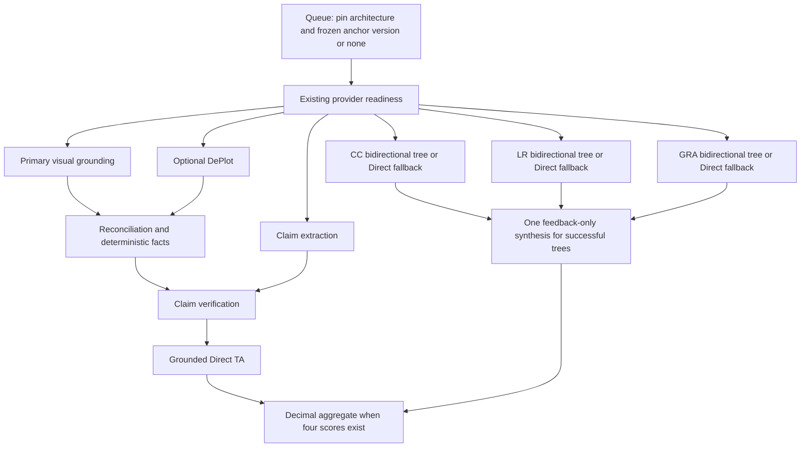

# T1-C: LCES-inspired Trait-wise Anchor Comparative Scoring

CURRENT implementation, 2026-10-09. This is an IELTS-specific **LCES-inspired** adaptation, named **Trait-wise Anchor Comparative Scoring (TACS)**. It is not an exact reproduction of original LCES. AI results are advisory; only explicit human grading changes official scores.

## 1. Motivation

Absolute LLM bands can vary with prompt wording and descriptor interpretation. Human-labelled responses offer reference points for testing whether relative language judgments improve calibration. This implementation makes that hypothesis measurable. It does not claim improved human agreement before a labelled evaluation.

## 2. Original LCES: high-level idea and limits

The adopted research idea is that relative essay comparisons may be more stable than generating an absolute scalar directly. The repository adds IELTS analytic criteria, a private human bank, bounded bidirectional searches, deterministic half-bands and visual Task 1 dependencies. Its search, failure rules and feedback contract are application choices; no original-paper result is attributed to this application.

## 3. TACS adaptation

Production Task 1 is Hybrid: grounded Direct Task Achievement (TA), and separate TACS searches for Coherence and Cohesion (CC), Lexical Resource (LR), and Grammatical Range and Accuracy (GRA). A language criterion falls back to Direct when its search cannot establish a supported score. Task 2 remains local MTS `mts-task2-v7`.

## 4. Why human labels

Each anchor has an administrator-validated full response and four finite half-band labels in 0–9. Task 1 labels are TA/CC/LR/GRA; Task 2 uses the compatible `ta` field for TR. No feedback or independent overall label is required. Model predictions and synthetic production anchors are not human calibration data. Fictional fixtures exist only in tests.

## 5. PostgreSQL model

Migration `20261008_0021` creates `writing_anchor_sets` and `writing_human_anchors`. A set has a version and DRAFT/ACTIVE/RETIRED lifecycle. Partial unique indexes allow one active and one working draft globally. All anchors store response text, four Numeric labels, creator and optional private note/provenance. Foreign keys restrict deletion of referenced tasks/creators/sets. Assets stay outside PostgreSQL.

Migration `20261009_0023` adds coherent source kinds. `BUILDER_TASK` requires the existing authoritative `writing_task_id` relation to a published/frozen Writing task; custom task number, prompt and type are absent. `CUSTOM_TASK` has no Builder FK and requires `task_number` (1 or 2) and a nonblank `custom_prompt`; `custom_task_type` is optional and uses the existing Writing taxonomy. Pydantic validates source/type combinations and four half-band scores; PostgreSQL also enforces source coherence and score constraints. Paragraphs are preserved. Existing anchors become `BUILDER_TASK` without rewriting frozen content or historical runs. Downgrade refuses to discard custom records.

Each working revision records `based_on_set_id`. Applying validates its current base, then atomically freezes it and retires its predecessor. The migration attaches any preexisting draft to the current active revision. No duplicate mutable Builder prompt or external visual-upload system is added.

PostgreSQL triggers guard frozen content, including raw SQL writes. Lifecycle changes use a transaction advisory lock; edits lock their owning set. Activation waits for an in-flight edit, retires the previous active set and publishes the draft atomically. An active set may transition to retired but cannot have its content rewritten. Migration `20261008_0022` adds nullable pinned execution and private diagnostic fields to AI runs without rewriting history.

## 6. Admin workflow

`/admin/writing-anchors` uses the existing protected admin layout and Vietnamese copy. Every API route under `/api/v1/admin/writing-anchors` requires AdminUser (401 unauthenticated, 403 non-admin). The administrator sees one **Bộ anchor hiện tại**, its response count, and **Sửa**, **Thêm bài**, **Xóa bộ anchor**. Without a current bank, **Tạo bộ anchor** creates an empty working copy. **Sửa** automatically creates or resumes a shared copy-on-write revision; the currently used revision stays immutable. Add/edit/delete changes only the working copy. **Lưu & áp dụng** publishes it for future runs; **Hủy thay đổi** discards only unapplied work and keeps the current bank.

The form's **Nguồn đề** offers **Chọn đề có sẵn trong hệ thống** (searchable frozen task picker, including archived previously published versions) or **Nhập đề ngoài** (Task 1/2, optional existing task type and required prompt). Both require response and four manual labels, without feedback/overall. External samples need no Builder test. Provenance and internal notes remain optional/private.

Confirmed **Xóa bộ anchor** retires the current revision and discards any unapplied working copy. Future production lookup sees no active bank: CC/LR/GRA use Direct fallback; TA remains grounded Direct. It does not delete historical anchors, AI runs, learner attempts or official human grades. Retired revisions cannot be selected for production through this UI. **Lịch sử thay đổi** is closed by default and offers read-only viewing. Technical/research disclosures are also closed by default.

The logical API exposes `GET /bank`, `POST /bank/edit`, `POST /bank/{id}/apply`, `DELETE /bank/{id}/working`, `DELETE /bank/{id}/current`, and `GET /history`. Current deletion verifies the expected revision ID so a stale request cannot disable a replacement. Existing revision/snapshot APIs remain compatible for internal and benchmark consumers. `GET /coverage?set_id=...` previews working or historical coverage without changing production selection; `active_set` remains the true current revision and `evaluated_set` identifies the displayed data.

## 7. Coverage strategy

Production coverage pools Task 1 CC/LR/GRA from both Builder-backed and custom anchors across prompts, visual types and tests. It does not require a same-task match. Half-band anchors remain stored and counted, but whole bands form search pivots. Pilot guidance is two anchors at each band 6/7/8; mature guidance is three at each band 5–9. Counts, contiguous ladders and EMPTY/PARTIAL/PAIRWISE USABLE/RECOMMENDED COVERAGE states are informational. Sparse/empty banks can activate safely. The UI shows Vietnamese readiness, Band 5–9 cells and **Dải band có thể dùng**, with full counts inside disclosure.

Task 1 TA is separate research metadata, grouped by frozen task or standalone source record. A custom Task 1 anchor has no stored visual in this workflow, so its TA label is **not** a reproducible grounded-TA benchmark sample. It can still calibrate CC/LR/GRA. Task 2 custom or Builder labels (TR/CC/LR/GRA) remain evaluation/future-TACS data; production Task 2 stays MTS. Readiness is never gated by TA or Task 2.

## 8. Why production TA is grounded Direct

TA evaluates overview, key features, selection, comparisons and factual accuracy against a particular visual. Comparing responses to unrelated visuals cannot supply that factual authority. TA therefore never accesses a production anchor ladder or comparator. It reuses the existing primary visual reference, optional fail-open DePlot reconciliation, deterministic facts and claim verdicts, then makes a Direct scoring turn. LOW confidence supports cautious qualitative judgment; UNUSABLE reference fails TA. Missing claim verification does not prove an essay error.

## 9. Final Task 1 architecture

All LLM completions use the same run-local bounded provider, default concurrency two, configurable one through four. Language branches overlap perception. SSE checkpoints use short serialized database transactions; no provider turn holds a DB session. DePlot remains a separate optional provider.

## 10. Tree search

For one task number and language criterion, choose the widest contiguous whole-band run containing at least two bands. Ties prefer overlap with 6–8, proximity to 7 and stable ascending start. Sparse 6/8 alone is not a ladder. First pivot is 7 when present; otherwise use the lower median. Later pivots use the lower median of the remaining interval. A consistent target-better result removes bands at or below the pivot; anchor-better removes bands at or above it. Search never invents support beyond the ladder.

## 11. Position bias

Each visited node compares the same selected response twice: target first/anchor second, then anchor first/target second. Context moves with its response. Normalize each directional preference to TARGET BETTER, ANCHOR BETTER or COMPARABLE. The comparator sees criterion semantics and two response texts/task prompts, without human labels, anchor designation, UUIDs, set version, private notes or provenance.

## 12. Strict consensus

Both normalized preferences must agree exactly. Comparable-versus-better is a conflict, as are opposing preferences. Any invalid/truncated/failed directional call abandons that criterion's tree. There is no comparator repair, third vote, tie-breaking anchor, majority vote or hidden retry. Both directions are attempted once. Trace/checkpoint failure cancels outstanding siblings promptly and remains a run failure.

## 13. Call budget

Default two nodes means at most four comparisons per language criterion and twelve across CC/LR/GRA before fallback. Benchmark budgets are one, two or three nodes (two, four or six comparisons per language criterion). Each comparison has a 128-token completion cap. Exhaustion uses Direct fallback. Every normal Direct criterion has one scoring request at 3072 tokens; the existing single bounded output repair is retained, with length repair capped at 4096. The one feedback synthesis is capped at 4096 and has no repair. Grounding, claims and optional DePlot costs are additional and unchanged.

## 14. Representative selection

Exactly one anchor represents a visited band. Candidates are sorted by stable UUID and a SHA-256 choice uses target fingerprint, criterion, band and frozen set identity/version. Identical execution inputs select the same representative; changing density/version changes the bank/cache identity. No random choice, all-anchor tournament or additional representative is used. Evaluation target labels and visual truth are excluded from the representative's target fingerprint.

## 15. Deterministic reconstruction

Strict comparable at pivot 7 yields 7.0. Consistent better than 7 and worse than 8 yields Decimal 7.5. Worse than 7 and better than 6 yields 6.5. Only adjacent supported bounds interpolate. Once the tree establishes a valid half-band, that criterion score is final for the AI run. Exhausted outer bounds produce OUT OF RANGE, with no clamping to 0/9 or estimated edge score.

## 16. Direct fallback

Reasons are NO ANCHORS, INSUFFICIENT CONTIGUOUS COVERAGE, OUT OF RANGE, POSITION CONFLICT, BUDGET EXHAUSTED and PAIRWISE PROVIDER FAILURE. Each language trait falls back independently with the existing descriptor validation/normalization boundary. TA is always GROUNDED DIRECT and is excluded from fallback counts. Private metadata records PAIRWISE/DIRECT FALLBACK, reason, visited nodes, selected IDs and directional outcomes. Selecting `AI_WRITING_TASK1_SCORER=direct` uses Direct for all four; `mts` retains the previous service.

## 17. Feedback reliability

One strict score-free synthesis request covers only successful pairwise CC/LR/GRA criteria. It receives the target response and established scores for feedback consistency, without anchor labels/text/metadata. Output contains Vietnamese feedback, strengths and improvements, never scores. Exact requested criterion keys and forbidden extras are validated.

If synthesis fails or returns a score field, established scores, PAIRWISE mode and tree diagnostics remain intact. `CriterionResult` uses `feedback=null`, empty strengths/improvements, `feedback_status=UNAVAILABLE`, `feedback_error_code=AI_FEEDBACK_UNAVAILABLE`. No fabricated feedback, rescore or Direct substitution follows. All valid scores can still aggregate and the run can complete. Legacy results default to AVAILABLE; raw Direct/MTS output still requires real feedback. The frontend shows the band plus an unavailable-feedback notice and preserves existing human comments when copying suggestions.

## 18. A0–A4 evaluation

The existing T1-C framework now supports A0 Direct; A1 MTS, including explicit legacy v3/current local v5 comparisons; A2 three independent full A0 runs with per-criterion median; A3 exact production Hybrid; A4 ordinal modelling reserved for future work. A2 records individual score/perception/cost summaries, spread and population variance. Its perception is certified OK only if all repeats are certified OK; missing/failed repeats cannot produce a certified aggregate. No production self-consistency voting is introduced.

A2 pools numeric perception counts from every repeat, recomputes agreement against all labelled truth values and uses the weakest repeat confidence. Sample-level certification and independent observation denominators are explicit. The current vLLM adapter fixes temperature and seed to zero; independent invocations can therefore yield three identical deterministic A0 results. Tests establish separate calls, not decoding diversity or measured gains.

CLI choices are `--architecture direct|mts|direct-self-consistency|anchor-pairwise|all`, default Hybrid, and `--tree-node-budget 1|2|3`. Explicit historical `--scoring-version` retains its MTS-only meaning. See [benchmark instructions](../benchmarks/writing_task1/README.md). No real benchmark is launched by the application.

## 19. Metrics and reports

Existing exact/±0.5/±1 agreement, MAE, RMSE, signed prediction-minus-human bias and QWK remain for every criterion and overall. Missing/insufficient/zero-variance QWK is explicit. ALL and PERCEPTION OK groups preserve perception diagnostics. Hybrid adds mean/p50/max language nodes, pairwise calls, visited bands, exact directional agreement, position conflicts and every fallback reason. Agreement denominator includes all visited language nodes, even invalid outputs. Fallback denominator is three language criteria per attempted Hybrid run. TA accuracy remains reported independently.

JSON/Markdown, disagreements CSV and architecture-costs CSV identify architecture and pinned set/version/density. Reports retain attempted failures, retries, latency and numeric token/call totals. Cache hits preserve original measured costs while new-call counters exclude reuse. Benchmark contract v2 and implementation/config hashes distinguish prior caches.

## 20. Leakage prevention

A3 sources are an explicitly supplied private version-1 anchor manifest or a read-only ACTIVE PostgreSQL snapshot; neither mutates production data. A private bank includes stable set/anchor identity, full prompt/response text, all four labels, source sample ID and nonblank provenance. Builder-backed records retain task/version identity; standalone custom records do not require those Builder IDs. Task 1/2 language pools stay separate. Custom Task 1 TA without visual evidence is not a grounded-TA benchmark target.

Before inference or cache reuse, reject any selected evaluation sample whose ID matches an anchor source ID or whose essay hash matches an anchor response. Hash normalization uses NFKC, casefold and whitespace collapse only for leakage detection; stored text is preserved. The CLI checks the entire selected split before `--limit`. Evaluation target labels, visual truth and private provenance never enter scorer requests. Source identity/content digest participates in A3 cache keys.

## 21. Privacy and security

The browser uses typed HTTP only; FastAPI owns all mutations and PostgreSQL is authoritative. Admin routes require the existing admin role. Responses/prompt/visual text are untrusted model data. Public run DTOs/SSE contain safe criterion/stage/score/feedback and existing target visual analysis, never bank UUIDs, labels, texts, pivots or directional preferences. Tree/config metadata is persisted separately from public result JSON. Reports store benchmark identifiers, counts and predictions, without source essays, anchor text, provenance, raw completions or credentials. Private datasets/reports remain ignored. Copyrighted test content is not added.

## 22. Latency and cost trade-off

Pairwise search does not guarantee lower latency or cost than Direct or MTS. Two directions per node, fallback scoring and synthesis can exceed MTS's two turns per criterion. Shared concurrency bounds resource use; perception dependencies still determine TA readiness. The retained [latency case study](enhance_latency.md) reports prior synthetic MTS measurements, not TACS performance. The twelve-comparison default bound is theoretical, before fallback, synthesis and perception. Real-model accuracy/latency/cost remain unmeasured in this implementation.

## 23. Failure modes

Empty/sparse banks safely use language Direct. Outer/budget/position failures abandon only the affected tree. Invalid Direct output gets the existing one repair and can fail its criterion; any missing criterion score suppresses overall while successful cards remain. Feedback failure preserves a deterministic score and overall eligibility. Unusable visuals fail TA; optional DePlot or claim-stage failure is fail-open from usable primary grounding. Cancellation/checkpoint outage is a run reliability failure; durable short checkpoints preserve completed scores and private partial tree progress. Heartbeat/lease recovery and cursor replay remain available.

## 24. Retained MTS

Task 1 MTS remains selectable and A1 remains a baseline. Task 2 continues MTS v7 unchanged. The retained [MTS paper](MTS.pdf), *Unleashing Large Language Models’ Proficiency in Zero-shot Essay Scoring*, is a research reference; this repository's IELTS adaptation does not use paper-level min-max scaling. Prior plans and version-specific verification notes are historical. Their results are not TACS claims.

## 25. Future work

Collect broader human banks with agreement/provenance checks; evaluate comparator reliability, density and node budgets; consider better comparative models and A4 ordinal methods only after evidence. Task 2 production cutover and exact-task TA experiments require separate validation and approval. Do not infer readiness for either from a Task 1 language pilot. Speaking and new authentication are excluded.

## 26. Interview Q&A

**Why separate TA?** It needs factual authority from the current visual; cross-task language references cannot supply that. **How is position bias handled?** Two swapped comparisons with exact normalized agreement, without a third vote. **What makes runs reproducible?** Immutable bank versions, enqueue-time pinning, stable representative selection and versioned fingerprints. **What happens when feedback fails?** The deterministic score remains final; feedback availability is explicit. **Did it improve accuracy?** That remains an evaluation question; fake-provider tests prove contracts and bounds, not human agreement.

## 27. Conservative CV examples

- Implemented an LCES-inspired IELTS Task 1 Hybrid scorer with grounded Direct TA, bounded bidirectional language comparisons and deterministic half-band reconstruction.
- Built a PostgreSQL versioned human anchor bank with immutable activation, admin curation, exact frozen-task selection and enqueue-time snapshot pinning.
- Extended an existing evaluation framework with Direct/MTS/self-consistency/Hybrid comparisons, split-wide leakage prevention and criterion-level accuracy/reliability/cost reporting.

Add percentages or speed/accuracy gains only after a reproducible labelled experiment; distinguish synthetic I/O measurements from deployed GPU performance.
